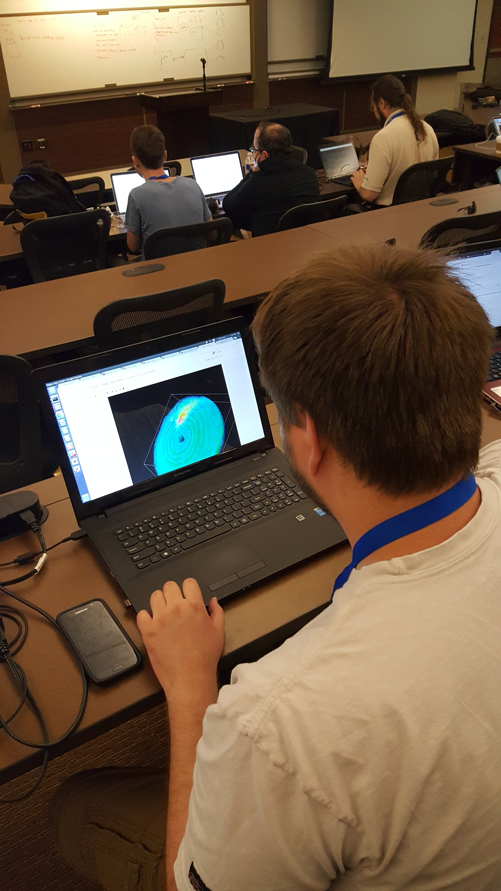

==============================
ARM Notes from the field story
==============================
-----------------------------------------------------------
Title: Learning New Tools and Giving Back, ARM at Scipy2017
-----------------------------------------------------------

ARM developers, translators, and engineers from three laboratories attended
the Scientific Computing with Python (Scipy, [1]) conference in Austin Texas in July of 2017. Scipy is
a unique conference focused on scientific applications of the programming language Python. The conference is organized into three components. The first two days are tutorials [2] followed by 3 days of conference talks [3]. What makes SciPy unique is the the final two day code sprint where attendees collaborate together to improve the state of open source packages live at the conference [4]. This code sprint not only improves the open source packages, but gives attendees a chance to learn from experienced software developers. 

A unique aspect of Scipy is that it is focuses on the tools that are used
across diverse domains. There is a focus on the "how" over the "what". The main
benefit to the ARM program is attendees come away with a quiver of new tools
saving many hours of coding and research.  

Developers and engineers from across the ARM program attended tutorials at the beginning of the week. They were led by expert instructors
(often core code developers) on Machine Learning, visualization, code optimization and project
Jupyter (an interactive notebook environment and tool for scientific
reproducibility). 

The Conference proper kicked off Wednesday with Keynote sessions and poster
sessions. Precipitation Radar Translator and Py-ART lead Scott Collis presented
a poster on ARM's radar retrieval efforts. Bobby Jackson and Mark Picel, also
from Argonne, showed some recent results from CMDV funded work on multi-Doppler
vertical velocity retrievals and storm cell tracking. 

On Friday Joseph Hardin, from Pacific Northwest National Lab and ARM radar
engineer gave a well received talk on WARNO: Watchdog for ARM Radar Network
Operations demonstrating how Python tools were being used to track the health of the ARM radar network.

Bhargavi Krishna from Oakridge National Laboratory and Erol Cromwell and Carina
Lansing from Pacific Northwest National Laboratory Gökhan Sever, a numerical
modeller from Argonne also attended to learn the
latest tools in the Scipy stack which will help them better deliver data to ARM
users. 

Saturday and Sunday was set aside for code sprinting where diverse (by funding
and field) scientists get together in large groups and collaboratively work
through issues in popular community software packages. Bobby and Zach sprinted
on the three dimensional visualization package yt [5], where the team was very
interested in using yt to visualize ARM radar data. Mark sprinted on Pandas [6]
which is a high performance data analysis library.

ARM Team members use open source software every working day. Scipy sprints allow us to give
back to the community tools that make our work possible and learn from very
clever developers along the way! 

.. figure:: joe.png
   :scale: 10 %
   :alt: joe

   Joseph Hardin, Radar Engineer from PNNL presents on ARM's WARNO architecture
   at Scipy2017.

   Zach Sherman, Software Developer from Argonne National Laboratory, sprints on
   the yt visualization package at Scipy2017.

[1] https://scipy2017.scipy.org

[2] https://scipy2017.scipy.org/ehome/220975/493418/

[3] https://scipy2017.scipy.org/ehome/220975/493422/

[4] https://scipy2017.scipy.org/ehome/220975/493419/

[5] http://yt-project.org/

[6] http://pandas.pydata.org/

